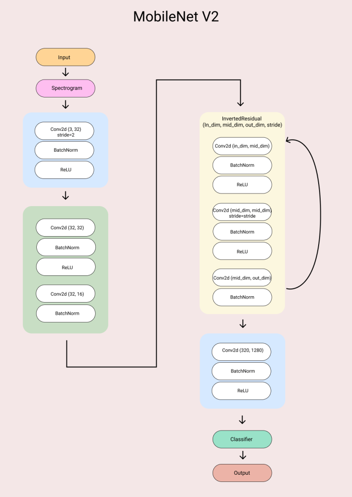
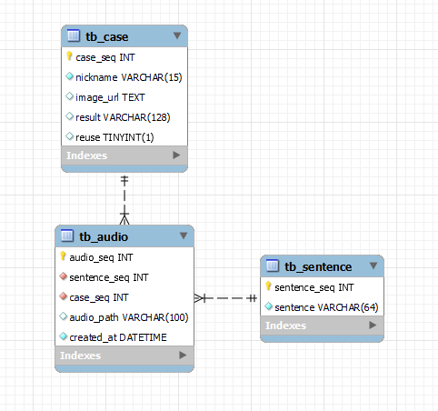

# 팀 '코코' ☕
- 도메인: 인공지능 음성
- 기획: 사용자 발화에 대해 지역 방언과의 유사도를 알려주는 서비스

<!--  -->

- 관련 링크
    - 일정 관리 및 메모: [Notion](https://www.notion.so/2-3-6831bb2eec164531af14b0296e39d1aa)
    - 팀 및 프로젝트 소개, 기록물: [Wiki](https://lab.ssafy.com/s06-ai-speech-sub2/S06P22A203/-/wikis/home)
    - 스토리보드: [Figma](https://www.figma.com/file/R3nBd2AO4kMK2cPeYSM5zh/Team_COCO-team-library?node-id=411%3A3)
    - 이슈 관리: [Jira](https://jira.ssafy.com/secure/RapidBoard.jspa?rapidView=11328&projectKey=S06P22A203&view=planning.nodetail&issueLimit=100)
    - ERD 설계: [ERD Cloud](https://www.erdcloud.com/d/M2S4jr4ra8ruhDFGX)
    