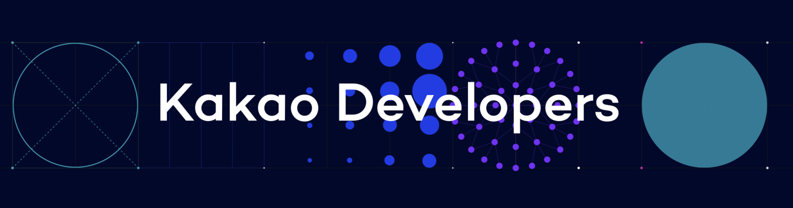
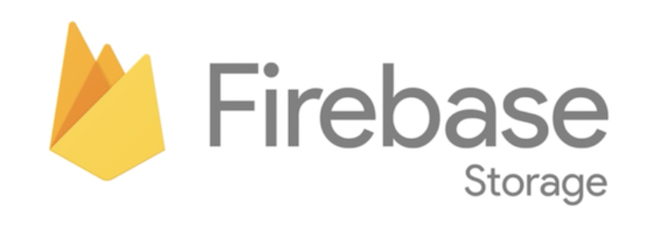
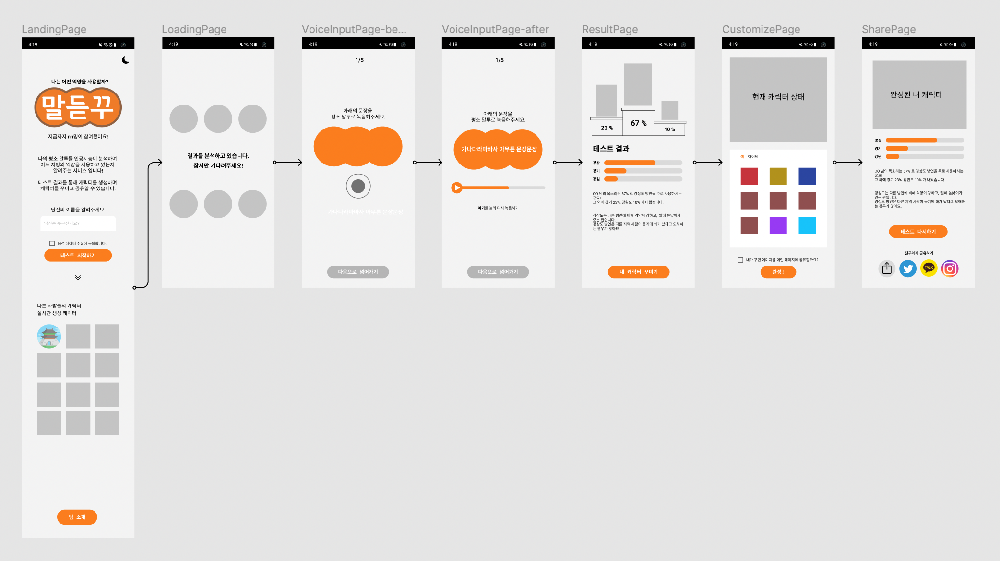
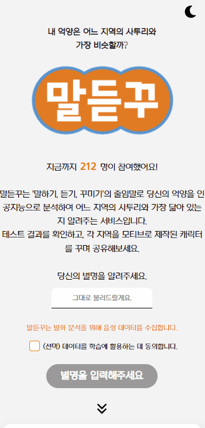
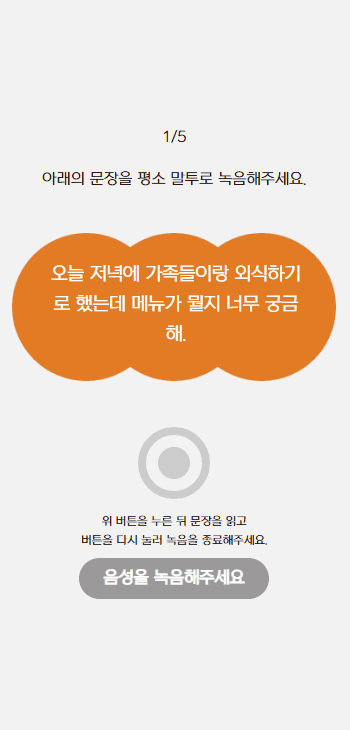
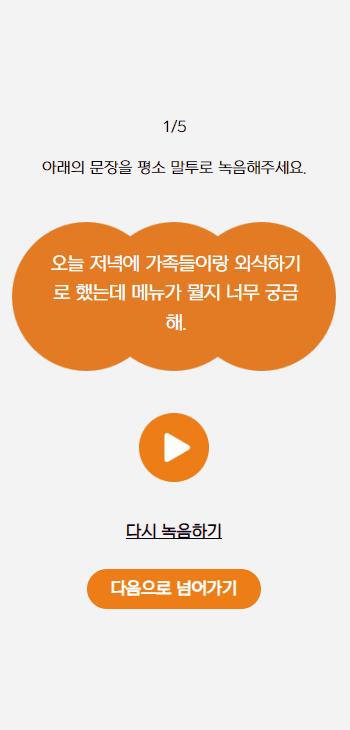
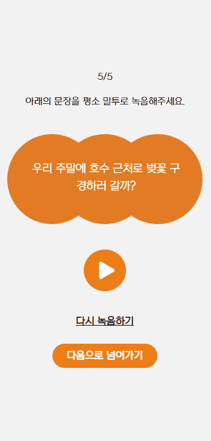
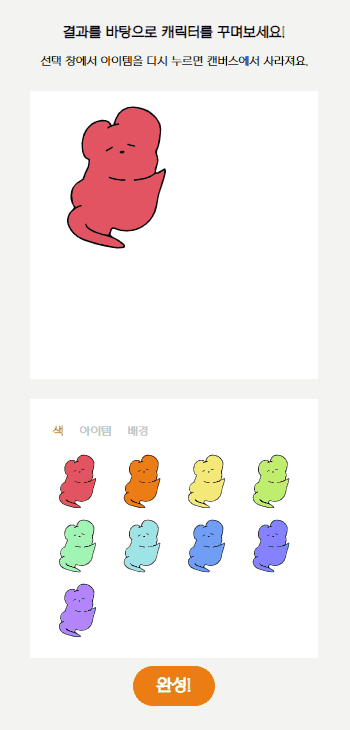
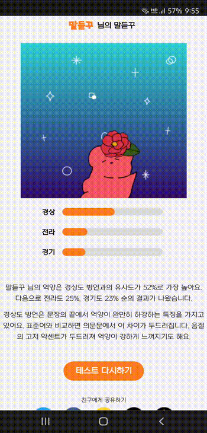
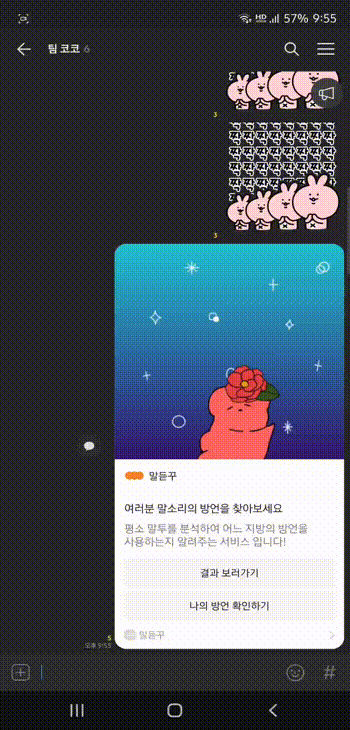

# Frontend

## 기술 특이점

### Next

프론트엔드는 React 라이브러리의 SSR 을 지원하는 Next.js 를 사용하여 개발이 진행되었습니다.\
Next.js 의 SSG (Static-Site-Generation) 은 SSR 과 다르게 요청시마다 페이지 생성을 하지 않고, 빌드하는 시기에 미리 페이지를 생성하게 됩니다.

저희의 프로젝트는 메인, 녹음, 결과 공유 등의 페이지에서 요청시마다 매번 새로운 페이지를 생성하지 않고, 이미 제작된 페이지 재활용이 가능 할 것이라 판단하였습니다.\
그리고 많은 유저들의 참여 유도가 필요하였고, SEO를 위해 검색 엔진에 저희 서비스 정보를 제공할 필요가 있었습니다.

이와 같은 이유로 Next.js 를 채택하여 개발을 진행하게 되었습니다.

  

### Kakao Message

사용자들은 다양한 서비스들을 지인들과 내용을 공유하기 위하여 SNS 서비스를 많이 활용하고 있습니다.\
저희 서비스도 사용자가 서비스를 공유하기 위하여 여러 방식을 제공하고 있습니다.\
그 중 대중적으로 가장 많이 사용되고 있는 카카오톡 공유하기 기능을 제공하기 위하여 카카오톡 메시지 기능을 사용하게 되었습니다.

사용자가 카카오톡 공유를 진행하게 되면, 본인이 제작한 커스텀 이미지와 결과 페이지를 확인할 수 있는 메시지를 전송 할 수 있습니다.
해당 메시지는 공유한 사용자의 결과 페이지로 이동이 가능하거나 테스트 시작 페이지로 이동이 가능합니다. 

 

### Firebase Storage

사용자가 테스트 이후 본인만의 이미지를 제작하였을때, 이미지 파일을 저장하기 위한 저장소로 Firebase Storage 를 활용하였습니다.\
Firebase Storage 에 저장된 이미지 url 을 자체 서버 DB(mySQL)에 기록하여 저희 서비스 서버의 부하를 줄이는 방식으로 관리하였습니다.

이전 사용자들의 이미지를 다운로드 혹은 조회를 위해서는 DB에 저장된 url 을 이용하여 다운로드 및 조회 서비스를 제공하였습니다.

 

---

## wireframe

 

---

## 화면별 상세설명

### 메인 페이지

 

메인페이지에는 저희 서비스의 로고, 서비스 내용이 텍스트로 명시되어 있습니다.\
화면 우측 상단의 달 또는 해의 아이콘을 터치하여 눈이 피로하지 않게 어두운 테마를 적용 또는 해제할 수 있습니다.

 

저희 서비스에 참여한 인원을 확인할 수 있습니다.\
사용자에게 음성 분석을 위해 음성 데이터 수집이 된다는 안내사항을 명시 및 선택사항을 선택하여 저희 서비스의 발전을 위한 간단한 설문조사를 참여할 수 있습니다.

 

메인 페이지를 아래로 스크롤하여 이전의 다른 사용자들이 제작한 이미지를 확인 할 수 있습니다.\
이미지를 하나씩 터치하면 터치한 이미지를 조금 더 확대된 이미지로 감상 할 수 있습니다.

 

 

사용자에게 친근한 느낌을 제공하기 위하여 사용자로부터 별명을 입력받고 있습니다.\
별명을 입력한 이후 테스트에 참여할 수 있습니다.

 

### 녹음 페이지

 

테스트에 이용되는 문장은 DB에 저장되어 있는 수 많은 문장들 중 5가지만 선별하여 사용자에게 제공됩니다.\
상단의 숫자들을 표기하여 테스트 진행 상황을 확인 할 수 있습니다.

 

동그란 녹음 버튼을 한번 누르고 사용자가 문장을 읽어 음성을 녹음하게 됩니다.

 

녹음이 진행 중인 상황을 사용자에게 명확하게 인식시켜주기 위하여 녹음 버튼에 애니메이션을 추가하였습니다.

 

동그란 원의 빨간색이 채워지는 수준으로 녹음 경과 시간을 대략적으로 파악 할 수 있습니다.

 

 

음성에 문제가 있다면 다시 녹음하기를 선택하여 재녹음을 진행 할 수 있고, 문제가 없다면 다음으로 넘어가기를 선택하여 다음 단계를 진행 할 수 있습니다.

 

 

녹음이 정상적으로 완료되면 재생 버튼이 활성화 됩니다.\
재생 버튼을 클릭하여 방금 녹음한 음성을 확인 할 수 있습니다.

 

### 결과 페이지

 

테스트가 모두 정상적으로 진행이 된 경우 결과 페이지로 이동됩니다.\
결과는 상위 3개의 지역이 나타나게 됩니다.

 

화면 상단의 순위 단상에 지역을 형상화한 캐릭터가 보여집니다.\
지역별 비율을 한눈에 비교하기 쉽도록 그림으로 표시됩니다.

 

하단에는 1순위 지역 방언의 특징이 보여집니다.\
내 캐릭터 꾸미기를 선택하여 결과에 맞는 추가적인 이미지 제작이 가능합니다.

 

### 커스텀 페이지

 

1순위 지역의 모습을 형상화한 대표 캐릭터가 자동으로 선택이 됩니다.\
하단의 색상을 선택하여 캐릭터 색상 변경이 가능합니다.

 

결과로 나온 상위 3개의 지역의 특징을 살린 아이템들도 최대 3개까지 추가가 가능하고, 배경도 선택이 가능합니다.

 

위의 캔버스의 캐릭터들을 드래그하여 원하는 곳에 위치시킬 수 있습니다.

 

### 공유 페이지

 

최종적으로 사용자가 제작한 이미지와 결과를 확인 할 수 있는 페이지입니다.\
테스트 결과와 내가 만든 이미지를 트위터, 페이스북, 카카오 와 같은 SNS 에 해당 페이지를 지인들에게 공유 할 수 있습니다.

 

그 외의 블로그, 인스타그램 등과 같은 서비스에는 링크를 복사하여 공유 할 수 있습니다.\
또한, 이미지를 기기에 저장 할 수 있습니다.

 

다시 한번 테스트 진행을 원하거나, 새로운 사용자가 테스트 진행을 원하는 경우 하단의 테스트 다시하기 버튼을 통해 지속적으로 서비스를 이용 할 수 있습니다.

 

 

 

카카오톡으로 공유하였을때 메시지 모습입니다.\
공유하는 사용자가 제작한 이미지가 메인으로 나타나게 됩니다.

 

결과 보러가기 버튼을 이용하여 결과 화면으로 이동할 수 있습니다.\
나의 방언 확인하기 버튼을 이용하여 테스트를 체험할 수 있습니다.